# External SWF Asset Catalog

Companion catalog to `docs/asset-inventory.md` (which covers the 156 `.as` classes /
98 rows embedded directly in the compiled `Gazillionaire.swf`). This document covers
the **156 standalone `.swf` files** at
`Gazillionaire.app/Contents/Resources/SWF/`, loaded at runtime by relative path from
`mx.controls.Image` descriptors (literal `"source":"./SWF/NAME.SWF"`) or built
dynamically at runtime (`"SWF/" + baseName + suffix + ".SWF"`) inside
`engine/src/Gazillionaire.as`.

## Completeness sweep

**What was checked:**

1. **Full `Resources/` tree walked** (not just `SWF/`) via
   `find .../Resources -type f`. Besides `SWF/` (156 files, confirmed count — matches
   the figure from the prior pass) and the main `Gazillionaire.swf`, the tree contains:
   - `MP3/` — **175 `.mp3` files**, sound effects/stingers. Many share a base name with
     a `SWF/` file (e.g. `BANDITS.MP3` alongside `BANDITS.SWF`, played together via
     `playSoundNoLoop("MP3/BANDITS.MP3")` right next to the image assignment) — this is
     a **paired audio channel**, not previously cataloged anywhere. Out of scope for
     this pass (art only) but worth its own catalog later.
   - `PNG/` — **30 `.png` files**. Mostly `PLANET3.PNG`-style "level 3" planet variants
     (`BASS3.PNG`, `FRAC3.PNG`, … — a third zoom/upgrade level beyond the `SWF/`
     folder's level-1/level-2 planet art) plus **`OP1.PNG`–`OP6.PNG` and
     `OP1A.PNG`–`OP6A.PNG`**, loaded dynamically as
     `"PNG/OP" + (this.g.winner - 6) + ".PNG"` etc. (Gazillionaire.as ~line 51134,
     51513, 63386, 67715). **These are opponent/rival-company portraits** — a real,
     external, non-embedded portrait asset. **This corrects
     `docs/asset-inventory.md` finding #3** ("no alien/opponent portrait art exists at
     all"): that finding was scoped to the main SWF's `[Embed]` classes and is still
     true for that scope, but opponent portraits DO exist as loose external files —
     they just live in `PNG/`, not as an embedded class, which is why the earlier
     grep for class names found nothing. Also out of scope for this SWF-only pass;
     flagged here so it isn't missed.
   - `resources/` (lowercase, singular-vs-`Resources/`) — **60 files**. This is a
     **third asset channel** distinct from both the main-SWF embeds and the `SWF/`
     folder: it holds what look like the original **source** files for many of the
     main SWF's `[Embed]`-ed gui-chrome/icon assets under their pre-build names
     (`b_circle.swf`, `f_fillblue.png`, `f_fillred.png`, `i_zinn.png`,
     `i_warehouse.png`, `stars_main.swf`, etc. — names matching the `_class_embed_css_*`
     / `_embed_mxml_*` class names in `asset-inventory.md`), **plus 14
     `PlanetNAME1.SWF` files** (`BASS1.SWF`, `FRAC1.SWF`, `HORK1.SWF`, `LORO1.SWF`,
     `MIRA1.SWF`, `NOSH1.SWF`, `OOOM1.SWF`, `PYKE1.SWF`, `QUEG1.SWF`, `STYE1.SWF`,
     `TILO1.SWF`, `VEXX1.SWF`, `XEEN1.SWF`, `ZILE1.SWF`) that are very likely the exact
     source files compiled into the `Gazillionaire_Planet*1Class` embeds
     (`asset-inventory.md` rows for `148.bin`, `139.bin`, etc.) — **not byte-diffed in
     this pass**, flagged for a follow-up check rather than assumed identical.
     Notably `f_fillblue.png`/`f_fillred.png` **do exist here**, even though
     `asset-inventory.md` finding #5 says no bytes were recoverable for those two
     fuel-gauge classes from the decompiled `.as` — **this loose `resources/` copy may
     close that gap** for modloader purposes and is worth a direct look.
   - `icon-gaz/`, `Icon.icns` — app icons (not game art).
   - `META-INF/`, `mimetype` — AIR packaging/signing metadata, not assets.
   - **No fourth channel found.** Every file under `Resources/` falls into one of:
     main-SWF embeds (already cataloged), `SWF/` (this catalog), `MP3/`, `PNG/`,
     `resources/`, or app packaging/icons.

2. **File count under `Resources/SWF/`: confirmed 156** (`ls | wc -l` → 156, matching
   the number carried over from the prior pass — not just assumed).

3. **Two-direction reference cross-check:**
   - *Folder → code:* every file was grepped case-insensitively by base name against
     `Gazillionaire.as`. **155 of 156 resolve to at least one real usage site.**
     **`BANK2_N.SWF` is the sole exception — zero matches for `BANK2_N` anywhere in
     Gazillionaire.as, in any form.** `BANK2A_N.SWF` (its "A" sibling) IS referenced
     (`frm_Bank_image`, lines 48749/54196), but the non-"A" `BANK2_N.SWF` is not. This
     looks like a genuinely **orphaned/dead asset** — flagged in its table row below.
   - *Code → folder:* every distinct literal `"./SWF/NAME.SWF"` / `"SWF/NAME.SWF"`
     string in the file (128 distinct literal filenames, extracted via regex) was
     checked against the files on disk. **All 128 resolve to a real file with
     matching case.** No missing files, no case mismatches.
   - **Dynamic path construction confirmed and accounted for**, explaining why many
     files (planet `*2.SWF` variants, ship `*A.SWF` variants) don't show up as a
     literal string: `planet_image_swf()` (~Gazillionaire.as:50043-50099) builds
     `"SWF/" + PLANETNAME + levelSuffix + ".SWF"` (levelSuffix `""` or `"2"`), and
     `frm_Travel1_ship` (~line 63035) builds
     `"SWF/SHIP" + playerShip + "A.SWF"`. Both patterns were traced to source and are
     noted per-row below instead of being reported as unmatched.

**Result: clean bill of health except one orphaned file (`BANK2_N.SWF`) and the
`resources/`+`PNG/` discoveries above**, which don't affect this SWF-only catalog's
completeness but are worth a maintainer's attention before calling the full asset
picture "done."

## Summary

Total external SWF files cataloged: **156**. Static (1 frame): **127**. Animated (>1 frame): **29**.

| Category | Count |
|---|---|
| Ship | 24 |
| Alien NPC (named character) | 88 |
| GUI | 2 |
| Environment (planet surface) | 28 |
| Background | 2 |
| Title Screen | 2 |
| Cutscene / Intro | 8 |
| Other | 2 |

## Ship (24)

| Filename | Thumbnail | Frame count | Category | Suggested name | Used at (Gazillionaire.as reference) | Notes |
|---|---|---|---|---|---|---|
| SHIP1.SWF | 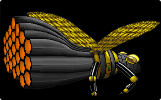 | 1 | ship | Ship 1 (selection art) | Gazillionaire.as:6669 |  |
| SHIP10.SWF | 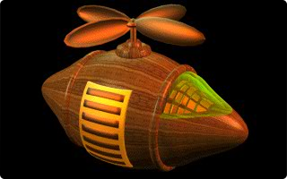 | 1 | ship | Ship 10 (selection art) | Gazillionaire.as:6831 |  |
| SHIP10A.SWF |  | 1 | ship | Ship 10 (in-flight variant) | `frm_Travel1_ship` dynamic path `"SWF/SHIP" + playerShip + "A.SWF"` (Gazillionaire.as:63035) |  |
| SHIP11.SWF | 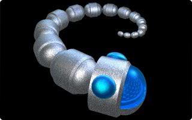 | 1 | ship | Ship 11 (selection art) | Gazillionaire.as:6849 |  |
| SHIP11A.SWF |  | 1 | ship | Ship 11 (in-flight variant) | `frm_Travel1_ship` dynamic path `"SWF/SHIP" + playerShip + "A.SWF"` (Gazillionaire.as:63035) |  |
| SHIP12.SWF | 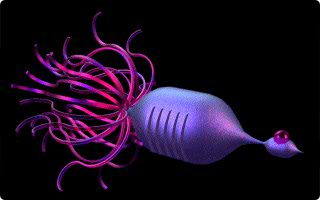 | 1 | ship | Ship 12 (selection art) | Gazillionaire.as:6867 |  |
| SHIP12A.SWF |  | 1 | ship | Ship 12 (in-flight variant) | `frm_Travel1_ship` dynamic path `"SWF/SHIP" + playerShip + "A.SWF"` (Gazillionaire.as:63035) |  |
| SHIP1A.SWF |  | 1 | ship | Ship 1 (in-flight variant) | `frm_Travel1_ship` dynamic path `"SWF/SHIP" + playerShip + "A.SWF"` (Gazillionaire.as:63035) |  |
| SHIP2.SWF | 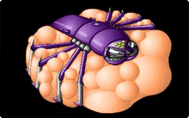 | 1 | ship | Ship 2 (selection art) | `frm_ChooseShip2` (Gazillionaire.as:333) |  |
| SHIP2A.SWF | 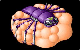 | 1 | ship | Ship 2 (in-flight variant) | `frm_Travel1_ship` dynamic path `"SWF/SHIP" + playerShip + "A.SWF"` (Gazillionaire.as:63035) |  |
| SHIP3.SWF | 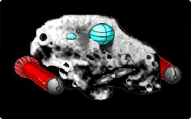 | 1 | ship | Ship 3 (selection art) | `frm_ChooseShip3` (Gazillionaire.as:347) |  |
| SHIP3A.SWF | 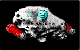 | 1 | ship | Ship 3 (in-flight variant) | `frm_Travel1_ship` dynamic path `"SWF/SHIP" + playerShip + "A.SWF"` (Gazillionaire.as:63035) |  |
| SHIP4.SWF | 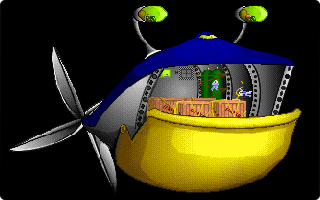 | 1 | ship | Ship 4 (selection art) | Gazillionaire.as:6723 |  |
| SHIP4A.SWF | 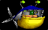 | 1 | ship | Ship 4 (in-flight variant) | `frm_Travel1_ship` dynamic path `"SWF/SHIP" + playerShip + "A.SWF"` (Gazillionaire.as:63035) |  |
| SHIP5.SWF | 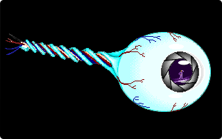 | 1 | ship | Ship 5 (selection art) | Gazillionaire.as:6741 |  |
| SHIP5A.SWF | 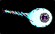 | 1 | ship | Ship 5 (in-flight variant) | `frm_Travel1_ship` dynamic path `"SWF/SHIP" + playerShip + "A.SWF"` (Gazillionaire.as:63035) |  |
| SHIP6.SWF | 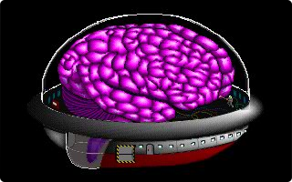 | 1 | ship | Ship 6 (selection art) | Gazillionaire.as:6759 |  |
| SHIP6A.SWF | 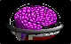 | 1 | ship | Ship 6 (in-flight variant) | `frm_Travel1_ship` dynamic path `"SWF/SHIP" + playerShip + "A.SWF"` (Gazillionaire.as:63035) |  |
| SHIP7.SWF | 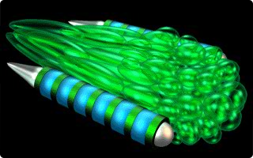 | 1 | ship | Ship 7 (selection art) | Gazillionaire.as:6777 |  |
| SHIP7A.SWF | 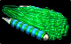 | 1 | ship | Ship 7 (in-flight variant) | `frm_Travel1_ship` dynamic path `"SWF/SHIP" + playerShip + "A.SWF"` (Gazillionaire.as:63035) |  |
| SHIP8.SWF | 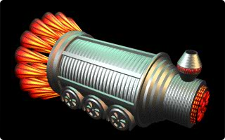 | 1 | ship | Ship 8 (selection art) | Gazillionaire.as:6795 |  |
| SHIP8A.SWF | 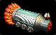 | 1 | ship | Ship 8 (in-flight variant) | `frm_Travel1_ship` dynamic path `"SWF/SHIP" + playerShip + "A.SWF"` (Gazillionaire.as:63035) |  |
| SHIP9.SWF | 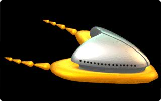 | 1 | ship | Ship 9 (selection art) | Gazillionaire.as:6813 |  |
| SHIP9A.SWF |  | 1 | ship | Ship 9 (in-flight variant) | `frm_Travel1_ship` dynamic path `"SWF/SHIP" + playerShip + "A.SWF"` (Gazillionaire.as:63035) |  |

## Alien NPC (named character) (88)

| Filename | Thumbnail | Frame count | Category | Suggested name | Used at (Gazillionaire.as reference) | Notes |
|---|---|---|---|---|---|---|
| AGENT_L.SWF | 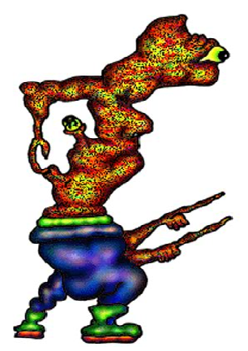 | 6 | alien-npc | Agent (loading/special) | `frm_Special_image` (Gazillionaire.as:56631) |  |
| ASIAN_N.SWF | 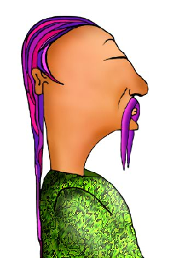 | 21 | alien-npc | Asian (NPC) | `frm_Special_image` (Gazillionaire.as:56345) |  |
| BANDITS.SWF | 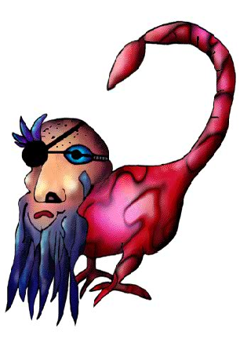 | 1 | alien-npc | Bandits | `frm_Travel2_vertical_image` (Gazillionaire.as:65956) |  |
| BANK1A_N.SWF | 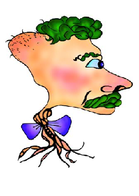 | 7 | alien-npc | Bank1A (NPC) | `frm_Bank_image` (Gazillionaire.as:48735) |  |
| BANK1_N.SWF | 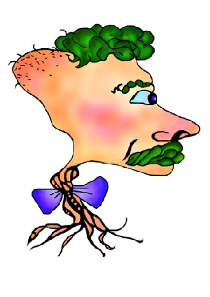 | 7 | alien-npc | Bank1 (NPC) | `frm_Travel2_vertical_image` (Gazillionaire.as:64767) |  |
| BANK2A_N.SWF |  | 7 | alien-npc | Bank2A (NPC) | `frm_Bank_image` (Gazillionaire.as:48749) |  |
| BANK2_N.SWF |  | 7 | alien-npc | Bank2 (NPC) | *(none found — orphaned asset, see completeness sweep)* | **ORPHANED — no reference to this filename (in any form) found anywhere in Gazillionaire.as.** Confirmed dead asset (or reached via a mechanism outside the decompiled .as source); see completeness sweep. |
| BOBBLE.SWF | 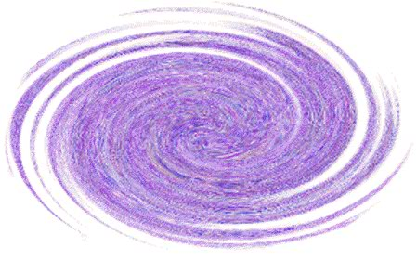 | 1 | alien-npc | Bobble | `frm_Travel2_image_ship` (Gazillionaire.as:66488) |  |
| BOLLUP.SWF | 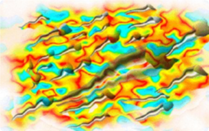 | 1 | alien-npc | Bollup | `frm_Travel2_image_ship` (Gazillionaire.as:66425) |  |
| BROKER_N.SWF | 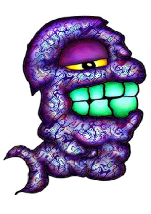 | 10 | alien-npc | Broker (NPC) | `frm_Special_image` (Gazillionaire.as:56647) |  |
| BRONAP.SWF | 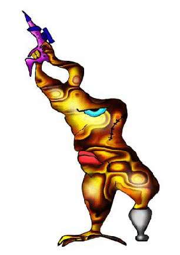 | 1 | alien-npc | Bronap | `frm_Travel2_vertical_image` (Gazillionaire.as:66248) |  |
| CLOCK_L.SWF | 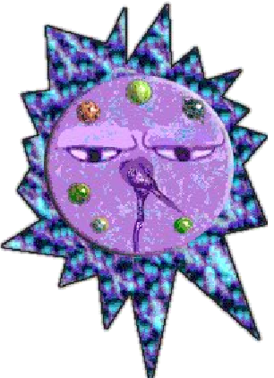 | 20 | alien-npc | Clock (loading/special) | `frm_Time_image` (Gazillionaire.as:59765) |  |
| CORNU_N.SWF | 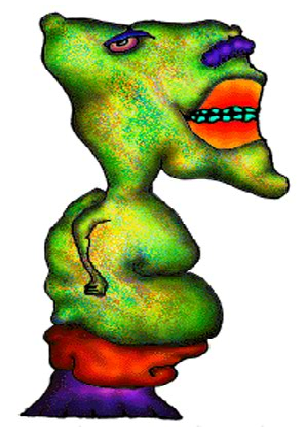 | 24 | alien-npc | Cornu (NPC) | `frm_Special_image` (Gazillionaire.as:56501) |  |
| CREW_N.SWF | 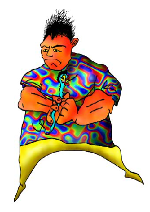 | 20 | alien-npc | Crew (NPC) | `frm_Employee_image` (Gazillionaire.as:56099) |  |
| CREW_S.SWF |  | 1 | alien-npc | Crew (NPC alt) | `frm_Employee_image` (Gazillionaire.as:56051) |  |
| CURTIS.SWF | 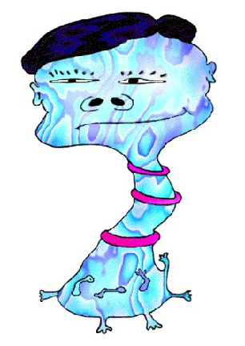 | 1 | alien-npc | Curtis | `frm_Travel2_vertical_image` (Gazillionaire.as:63906) |  |
| CYLET.SWF | 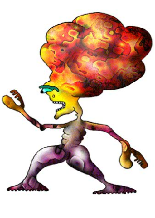 | 1 | alien-npc | Cylet | `frm_Travel2_vertical_image` (Gazillionaire.as:66114) |  |
| DARLEEN.SWF | 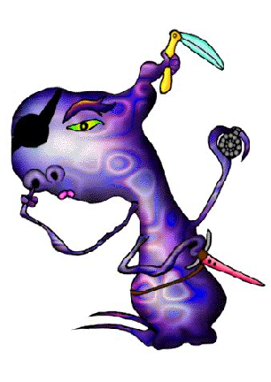 | 1 | alien-npc | Darleen | `frm_Travel2_vertical_image` (Gazillionaire.as:65919) |  |
| DEALER_N.SWF | 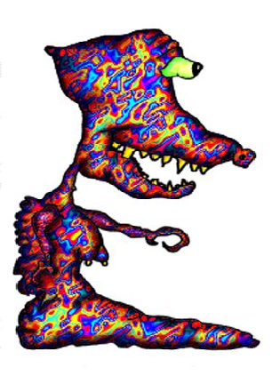 | 25 | alien-npc | Dealer (NPC) | `frm_Special_image` (Gazillionaire.as:56464) |  |
| DEXXYGAS.SWF | 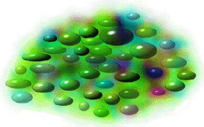 | 1 | alien-npc | Dexxygas | `frm_Travel2_image_ship` (Gazillionaire.as:66383) |  |
| DRED.SWF | 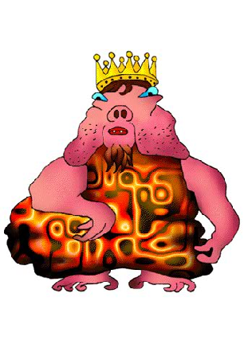 | 1 | alien-npc | Dred | Gazillionaire.as:11225 |  |
| FEZFAFA.SWF | 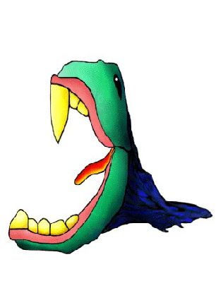 | 1 | alien-npc | Fezfafa | `frm_Travel2_vertical_image` (Gazillionaire.as:66051) |  |
| FIRE.SWF | 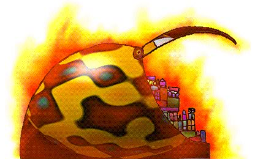 | 1 | alien-npc | Fire | Gazillionaire.as:72 |  |
| GURTTLE.SWF | 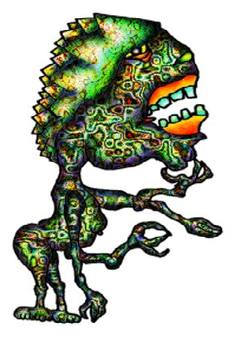 | 1 | alien-npc | Gurttle | `frm_Travel2_vertical_image` (Gazillionaire.as:65215) |  |
| HANDS.SWF | 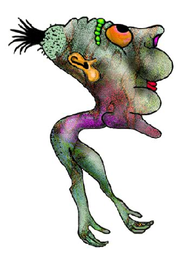 | 1 | alien-npc | Hands | `frm_Travel2_vertical_image` (Gazillionaire.as:64927) |  |
| HAPA.SWF | 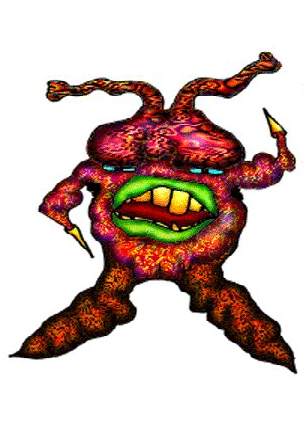 | 1 | alien-npc | Hapa | `frm_Travel2_vertical_image` (Gazillionaire.as:65469) |  |
| HUNGO.SWF | 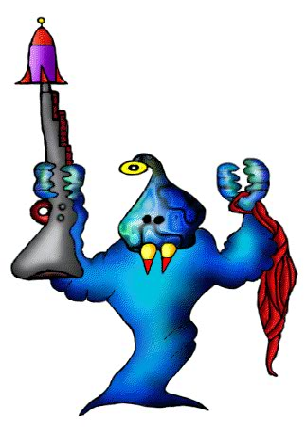 | 1 | alien-npc | Hungo | `frm_Travel2_vertical_image` (Gazillionaire.as:66077) |  |
| INSURE_N.SWF | 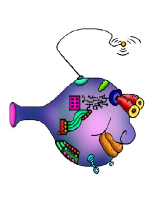 | 17 | alien-npc | Insure (NPC) | Gazillionaire.as:11074 |  |
| INSURE_S.SWF |  | 1 | alien-npc | Insure (NPC alt) | `frm_Insurance_image` (Gazillionaire.as:56212) |  |
| ISO.SWF | 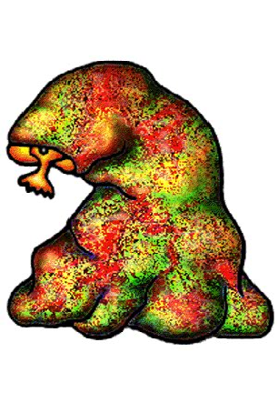 | 1 | alien-npc | Iso | `frm_Travel2_vertical_image` (Gazillionaire.as:65103) |  |
| LEAHY.SWF | 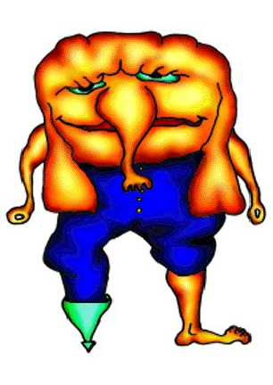 | 1 | alien-npc | Leahy | `frm_Travel2_vertical_image` (Gazillionaire.as:65323) |  |
| LIMPUS.SWF | 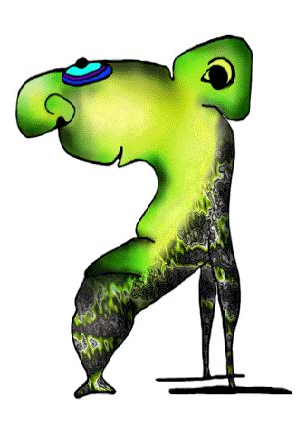 | 1 | alien-npc | Limpus | `frm_Travel2_vertical_image` (Gazillionaire.as:65055) |  |
| LIPPO.SWF | 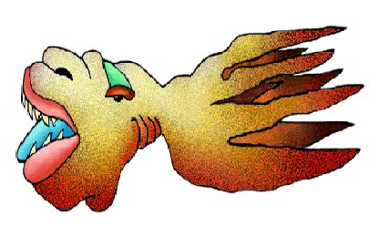 | 1 | alien-npc | Lippo | `frm_Travel2_image_ship` (Gazillionaire.as:66184) |  |
| LOAN2_N.SWF | 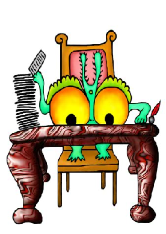 | 9 | alien-npc | Loan2 (NPC) | `frm_Loan_image` (Gazillionaire.as:54232) |  |
| LOAN_N.SWF |  | 9 | alien-npc | Loan (NPC) | `frm_Loan_not_enough_cash` (Gazillionaire.as:48761) |  |
| LORD.SWF | 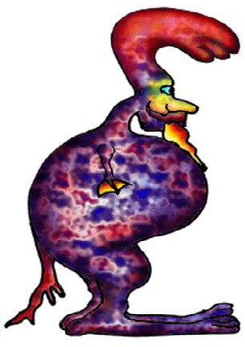 | 1 | alien-npc | Lord | `frm_Travel2_vertical_image` (Gazillionaire.as:65247) |  |
| LUMBOR.SWF |  | 1 | alien-npc | Lumbor | `frm_Travel2_vertical_image` (Gazillionaire.as:66628) |  |
| MECHAN_L.SWF |  | 6 | alien-npc | Mechan (loading/special) | `frm_Special_image` (Gazillionaire.as:56552) |  |
| MECH_N.SWF |  | 23 | alien-npc | Mech (NPC) | `frm_Special_image` (Gazillionaire.as:56368) |  |
| MEEG.SWF |  | 1 | alien-npc | Meeg | `frm_Travel2_vertical_image` (Gazillionaire.as:64215) |  |
| METEOR.SWF |  | 1 | alien-npc | Meteor | `frm_Travel2_image_ship` (Gazillionaire.as:66302) |  |
| MIPPI.SWF |  | 1 | alien-npc | Mippi | `frm_Travel2_image_ship` (Gazillionaire.as:66404) |  |
| MONEY_N.SWF |  | 11 | alien-npc | Money (NPC) | `frm_Travel5_image` (Gazillionaire.as:52052) |  |
| MONK_N.SWF |  | 31 | alien-npc | Monk (NPC) | `frm_Special_image` (Gazillionaire.as:56384) |  |
| MOOGLERS.SWF |  | 1 | alien-npc | Mooglers | `frm_Travel2_vertical_image` (Gazillionaire.as:66025) |  |
| MULLS.SWF |  | 1 | alien-npc | Mulls | `frm_Travel2_vertical_image` (Gazillionaire.as:65339) |  |
| NEBBIT.SWF |  | 1 | alien-npc | Nebbit | `frm_Travel2_vertical_image` (Gazillionaire.as:65173) |  |
| NECTUM.SWF |  | 1 | alien-npc | Nectum | `frm_Travel2_vertical_image` (Gazillionaire.as:65263) |  |
| NEWS_L.SWF |  | 8 | alien-npc | News (loading/special) | `frm_WinGame2_image` (Gazillionaire.as:51024) |  |
| NIBBLE.SWF |  | 1 | alien-npc | Nibble | `frm_Travel2_vertical_image` (Gazillionaire.as:64295) |  |
| NOSH_H.SWF |  | 1 | alien-npc | Nosh (horizontal) | `frm_Travel4_image_ship` (Gazillionaire.as:51778) |  |
| PEELIA_L.SWF |  | 10 | alien-npc | Peelia (loading/special) | `frm_Special_image` (Gazillionaire.as:56416) |  |
| PILOT.SWF |  | 1 | alien-npc | Pilot | `frm_Travel2_vertical_image` (Gazillionaire.as:64469) |  |
| POLICE.SWF |  | 1 | alien-npc | Police | `frm_Travel2_vertical_image` (Gazillionaire.as:63830) |  |
| QUASO.SWF |  | 1 | alien-npc | Quaso | `frm_Travel2_vertical_image` (Gazillionaire.as:64552) |  |
| QUIST.SWF |  | 1 | alien-npc | Quist | `frm_Travel2_vertical_image` (Gazillionaire.as:64967) |  |
| REBELS.SWF |  | 1 | alien-npc | Rebels | `frm_Travel2_vertical_image` (Gazillionaire.as:65893) |  |
| REPAIR.SWF |  | 1 | alien-npc | Repair | `frm_Travel2_image_ship` (Gazillionaire.as:66597) |  |
| RJ.SWF |  | 1 | alien-npc | Rj | `frm_Travel2_vertical_image` (Gazillionaire.as:65139) |  |
| SABOTAGE.SWF |  | 1 | alien-npc | Sabotage | Gazillionaire.as:51367 |  |
| SCOOTER.SWF |  | 1 | alien-npc | Scooter | `frm_Travel2_vertical_image` (Gazillionaire.as:64895) |  |
| SHIMMER.SWF |  | 1 | alien-npc | Shimmer | `frm_Travel2_vertical_image` (Gazillionaire.as:64423) |  |
| SLEG.SWF |  | 1 | alien-npc | Sleg | `frm_Travel2_vertical_image` (Gazillionaire.as:65071) |  |
| SNOZ.SWF |  | 1 | alien-npc | Snoz | `frm_Travel2_vertical_image` (Gazillionaire.as:65516) |  |
| SOOTH_N.SWF |  | 30 | alien-npc | Sooth (NPC) | `frm_Special_image` (Gazillionaire.as:56576) |  |
| SPEEVAK.SWF |  | 1 | alien-npc | Speevak | `frm_Travel2_vertical_image` (Gazillionaire.as:65452) |  |
| SPIKE.SWF |  | 1 | alien-npc | Spike | `frm_Travel2_vertical_image` (Gazillionaire.as:64260) |  |
| SQUOWK.SWF |  | 1 | alien-npc | Squowk | `frm_Travel2_vertical_image` (Gazillionaire.as:65289) |  |
| STORM.SWF |  | 1 | alien-npc | Storm | `frm_Travel2_horizontal_image` (Gazillionaire.as:66322) |  |
| STUBBS.SWF |  | 1 | alien-npc | Stubbs | `frm_Travel2_vertical_image` (Gazillionaire.as:65580) |  |
| TATILUS.SWF |  | 1 | alien-npc | Tatilus | `frm_Travel2_vertical_image` (Gazillionaire.as:65198) |  |
| TAX1H_N.SWF |  | 32 | alien-npc | Tax1H (NPC) | `frm_Travel4_image` (Gazillionaire.as:51807) |  |
| TAX1_N.SWF |  | 32 | alien-npc | Tax1 (NPC) | `frm_Tax_image` (Gazillionaire.as:56129) |  |
| TAX2H_N.SWF |  | 13 | alien-npc | Tax2H (NPC) | `frm_Travel4_image` (Gazillionaire.as:51861) |  |
| TAX2_N.SWF |  | 13 | alien-npc | Tax2 (NPC) | `frm_Tax_image` (Gazillionaire.as:56180) |  |
| TEAL.SWF |  | 1 | alien-npc | Teal | `frm_Travel2_vertical_image` (Gazillionaire.as:65562) |  |
| TEETER.SWF |  | 1 | alien-npc | Teeter | Gazillionaire.as:58110 |  |
| VAPOR.SWF |  | 1 | alien-npc | Vapor | `frm_Travel2_image_ship` (Gazillionaire.as:66446) |  |
| WAREHOUS.SWF |  | 1 | alien-npc | Warehous | `frm_MainMenu_button_warehouse` (Gazillionaire.as:1245) |  |
| WEATHER_L.SWF |  | 8 | alien-npc | Weather (loading/special) | `frm_Weather_load` (Gazillionaire.as:59339) |  |
| WHIRL.SWF |  | 1 | alien-npc | Whirl | `frm_Travel2_image_ship` (Gazillionaire.as:66467) |  |
| WICKY.SWF |  | 1 | alien-npc | Wicky | `frm_Travel2_vertical_image` (Gazillionaire.as:66211) |  |
| WOBBLER.SWF |  | 1 | alien-npc | Wobbler | `frm_Travel2_vertical_image` (Gazillionaire.as:64991) |  |
| YOYO.SWF |  | 1 | alien-npc | Yoyo | Gazillionaire.as:63994 |  |
| ZINN2_N.SWF |  | 29 | alien-npc | Zinn2 (NPC) | `frm_ZinnLoan_image` (Gazillionaire.as:54350) |  |
| ZINN_N.SWF |  | 29 | alien-npc | Zinn (NPC) | `frm_ChooseShip3_image` (Gazillionaire.as:50637) |  |
| ZOBROK_N.SWF |  | 9 | alien-npc | Zobrok (NPC) | `frm_Special_image` (Gazillionaire.as:58627) |  |
| ZOBROK_S.SWF |  | 1 | alien-npc | Zobrok (NPC alt) | `frm_Special_image` (Gazillionaire.as:56670) |  |

## GUI (2)

| Filename | Thumbnail | Frame count | Category | Suggested name | Used at (Gazillionaire.as reference) | Notes |
|---|---|---|---|---|---|---|
| WHITE_H.SWF |  | 1 | gui | White (horizontal) | Gazillionaire.as:8075 |  |
| WHITE_V.SWF |  | 1 | gui | White V | Gazillionaire.as:7116 |  |

## Environment (planet surface) (28)

| Filename | Thumbnail | Frame count | Category | Suggested name | Used at (Gazillionaire.as reference) | Notes |
|---|---|---|---|---|---|---|
| BASS.SWF |  | 1 | environment | Planet: Bass (surface art, level 1) | Gazillionaire.as:45245 | Duplicates content of `Gazillionaire_PlanetBass1Class` embedded in main SWF (asset-inventory.md). |
| BASS2.SWF |  | 1 | environment | Planet: Bass (level-2 surface art) | `planet_image_swf()` dynamic path `"SWF/" + planetName + level` (Gazillionaire.as:50045-50098) — level-2 suffix, no literal string match |  |
| FRAC.SWF |  | 1 | environment | Planet: Frac (surface art, level 1) | Gazillionaire.as:45247 | Duplicates content of `Gazillionaire_PlanetFrac1Class` embedded in main SWF (asset-inventory.md). |
| FRAC2.SWF |  | 1 | environment | Planet: Frac (level-2 surface art) | `planet_image_swf()` dynamic path `"SWF/" + planetName + level` (Gazillionaire.as:50045-50098) — level-2 suffix, no literal string match |  |
| HORK.SWF |  | 1 | environment | Planet: Hork (surface art, level 1) | Gazillionaire.as:45249 | Duplicates content of `Gazillionaire_PlanetHork1Class` embedded in main SWF (asset-inventory.md). |
| HORK2.SWF |  | 1 | environment | Planet: Hork (level-2 surface art) | `planet_image_swf()` dynamic path `"SWF/" + planetName + level` (Gazillionaire.as:50045-50098) — level-2 suffix, no literal string match |  |
| LORO.SWF |  | 1 | environment | Planet: Loro (surface art, level 1) | Gazillionaire.as:45251 | Duplicates content of `Gazillionaire_PlanetLoro1Class` embedded in main SWF (asset-inventory.md). |
| LORO2.SWF |  | 1 | environment | Planet: Loro (level-2 surface art) | `planet_image_swf()` dynamic path `"SWF/" + planetName + level` (Gazillionaire.as:50045-50098) — level-2 suffix, no literal string match |  |
| MIRA.SWF |  | 1 | environment | Planet: Mira (surface art, level 1) | Gazillionaire.as:45253 | Duplicates content of `Gazillionaire_PlanetMira1Class` embedded in main SWF (asset-inventory.md). |
| MIRA2.SWF |  | 1 | environment | Planet: Mira (level-2 surface art) | `planet_image_swf()` dynamic path `"SWF/" + planetName + level` (Gazillionaire.as:50045-50098) — level-2 suffix, no literal string match |  |
| NOSH.SWF |  | 1 | environment | Planet: Nosh (surface art, level 1) | Gazillionaire.as:45255 | Duplicates content of `Gazillionaire_PlanetNosh1Class` embedded in main SWF (asset-inventory.md). |
| NOSH2.SWF |  | 1 | environment | Planet: Nosh (level-2 surface art) | `planet_image_swf()` dynamic path `"SWF/" + planetName + level` (Gazillionaire.as:50045-50098) — level-2 suffix, no literal string match |  |
| OOOM.SWF |  | 1 | environment | Planet: Ooom (surface art, level 1) | Gazillionaire.as:45257 | Duplicates content of `Gazillionaire_PlanetOoom1Class` embedded in main SWF (asset-inventory.md). |
| OOOM2.SWF |  | 1 | environment | Planet: Ooom (level-2 surface art) | `planet_image_swf()` dynamic path `"SWF/" + planetName + level` (Gazillionaire.as:50045-50098) — level-2 suffix, no literal string match |  |
| PYKE.SWF |  | 1 | environment | Planet: Pyke (surface art, level 1) | Gazillionaire.as:45259 | Duplicates content of `Gazillionaire_PlanetPyke1Class` embedded in main SWF (asset-inventory.md). |
| PYKE2.SWF |  | 1 | environment | Planet: Pyke (level-2 surface art) | `planet_image_swf()` dynamic path `"SWF/" + planetName + level` (Gazillionaire.as:50045-50098) — level-2 suffix, no literal string match |  |
| QUEG.SWF |  | 1 | environment | Planet: Queg (surface art, level 1) | Gazillionaire.as:45261 | Duplicates content of `Gazillionaire_PlanetQueg1Class` embedded in main SWF (asset-inventory.md). |
| QUEG2.SWF |  | 1 | environment | Planet: Queg (level-2 surface art) | `planet_image_swf()` dynamic path `"SWF/" + planetName + level` (Gazillionaire.as:50045-50098) — level-2 suffix, no literal string match |  |
| STYE.SWF |  | 1 | environment | Planet: Stye (surface art, level 1) | Gazillionaire.as:45263 | Duplicates content of `Gazillionaire_PlanetStye1Class` embedded in main SWF (asset-inventory.md). |
| STYE2.SWF |  | 1 | environment | Planet: Stye (level-2 surface art) | `planet_image_swf()` dynamic path `"SWF/" + planetName + level` (Gazillionaire.as:50045-50098) — level-2 suffix, no literal string match |  |
| TILO.SWF |  | 1 | environment | Planet: Tilo (surface art, level 1) | Gazillionaire.as:4714 | Duplicates content of `Gazillionaire_PlanetTilo1Class` (+ duplicate embed) in main SWF (asset-inventory.md). |
| TILO2.SWF |  | 1 | environment | Planet: Tilo (level-2 surface art) | `planet_image_swf()` dynamic path `"SWF/" + planetName + level` (Gazillionaire.as:50045-50098) — level-2 suffix, no literal string match |  |
| VEXX.SWF |  | 1 | environment | Planet: Vexx (surface art, level 1) | Gazillionaire.as:4726 | Duplicates content of `Gazillionaire_PlanetVexx1Class` embedded in main SWF (asset-inventory.md). |
| VEXX2.SWF |  | 1 | environment | Planet: Vexx (level-2 surface art) | `planet_image_swf()` dynamic path `"SWF/" + planetName + level` (Gazillionaire.as:50045-50098) — level-2 suffix, no literal string match |  |
| XEEN.SWF |  | 1 | environment | Planet: Xeen (surface art, level 1) | Gazillionaire.as:45269 | Duplicates content of `Gazillionaire_PlanetXeen1Class` embedded in main SWF (asset-inventory.md). |
| XEEN2.SWF |  | 1 | environment | Planet: Xeen (level-2 surface art) | `planet_image_swf()` dynamic path `"SWF/" + planetName + level` (Gazillionaire.as:50045-50098) — level-2 suffix, no literal string match |  |
| ZILE.SWF |  | 1 | environment | Planet: Zile (surface art, level 1) | Gazillionaire.as:45271 | Duplicates content of `Gazillionaire_PlanetZile1Class` embedded in main SWF (asset-inventory.md). |
| ZILE2.SWF |  | 1 | environment | Planet: Zile (level-2 surface art) | `planet_image_swf()` dynamic path `"SWF/" + planetName + level` (Gazillionaire.as:50045-50098) — level-2 suffix, no literal string match |  |

## Background (2)

| Filename | Thumbnail | Frame count | Category | Suggested name | Used at (Gazillionaire.as reference) | Notes |
|---|---|---|---|---|---|---|
| STARS2.SWF |  | 1 | background | Stars2 | Gazillionaire.as:3856 |  |
| STARS_BG.SWF |  | 1 | background | Stars Bg | Gazillionaire.as:5591 |  |

## Title Screen (2)

| Filename | Thumbnail | Frame count | Category | Suggested name | Used at (Gazillionaire.as reference) | Notes |
|---|---|---|---|---|---|---|
| GAZ_TITLE_S.SWF |  | 1 | title-screen | Gaz Title (NPC alt) | Gazillionaire.as:3096 |  |
| NEWCONTINUE.SWF |  | 1 | title-screen | Newcontinue | Gazillionaire.as:3345 |  |

## Cutscene / Intro (8)

| Filename | Thumbnail | Frame count | Category | Suggested name | Used at (Gazillionaire.as reference) | Notes |
|---|---|---|---|---|---|---|
| INIT.SWF |  | 1 | cutscene | Init | Gazillionaire.as:79 |  |
| INIT_MONSTER.SWF |  | 1 | cutscene | Init Monster | Gazillionaire.as:3135 |  |
| LAVAMIND_S.SWF |  | 1 | cutscene | Lavamind (NPC alt) | Gazillionaire.as:3750 |  |
| LEVEL_PLANET.SWF |  | 1 | cutscene | Level Planet | Gazillionaire.as:4410 |  |
| LOSE.SWF |  | 1 | cutscene | Lose | `frm_HelpNew2_button_close` (Gazillionaire.as:789) |  |
| PROPEOPLE.SWF |  | 1 | cutscene | Propeople | Gazillionaire.as:4107 |  |
| WIN.SWF |  | 1 | cutscene | Win | Gazillionaire.as:45 |  |
| ZAP_INTRO.SWF |  | 1 | cutscene | Zap Intro | Gazillionaire.as:3921 |  |

## Other (2)

| Filename | Thumbnail | Frame count | Category | Suggested name | Used at (Gazillionaire.as reference) | Notes |
|---|---|---|---|---|---|---|
| GAZINFO.SWF |  | 1 | other | Gazinfo | Gazillionaire.as:4293 |  |
| HISTORY.SWF |  | 1 | other | History | `frm_Explore_button_history` (Gazillionaire.as:605) |  |
