# Loose PNG Asset Catalog (`Resources/PNG/`)

Companion catalog to `docs/asset-inventory.md` (156 embedded classes) and
`docs/asset-wiki/external-swf-catalog.md` (156 loose `.swf` files). This document
covers the **30 loose `.png`/`.PNG` files** at
`Gazillionaire.app/Contents/Resources/PNG/`, found during the completeness sweep for
the external-SWF catalog and cataloged here in full.

These load via `mx.controls.Image.source`, either as literal `"./PNG/NAME.PNG"`
strings in the compiled MXML descriptor tree, or built dynamically at runtime
(`"PNG/" + baseName + suffix + ".PNG"`) inside `engine/src/Gazillionaire.as`.

## Key findings

1. **`OP1.PNG`–`OP6.PNG` are the opponent/rival-company portraits.** This is the art
   `docs/asset-inventory.md` finding #3 said "does not exist at all" for the
   *embedded* SWF — it's correct that no portrait is embedded in the main SWF, but
   portraits do exist as loose external files. Confirmed by opening all six: six
   visually distinct cartoon alien characters (see table below for descriptions).
   Referenced via the dynamic pattern `"PNG/OP" + (this.g.winner - 6) + ".PNG"`
   (Gazillionaire.as:51134, in `frm_WinGame3`) and equivalent constructions at
   lines 51513, 51578, 51633 (`frm_Travel4`, opponent auctions), 63386/63495
   (`frm_Travel2_horizontal`, random opponent events), and 67715/67730/68064/70873
   (`frm_Travel3`, opponent engine-purchase events). Also referenced by six literal
   `"./PNG/OP1.PNG"`..`"./PNG/OP6.PNG"` strings in the compiled descriptor tree
   (lines 5980–6325 and 12996–13336) — these are pre-populated placeholder sources
   on the same image components before the dynamic code overwrites them.

2. **`OP1A.PNG`–`OP6A.PNG` are orphaned — no code path references them.** An
   exhaustive grep of `Gazillionaire.as` for any `"A"`-suffixed / conditional
   construction around the `PNG/OP` pattern found nothing; every call site above
   builds the path as `"PNG/OP" + n + ".PNG"` with no `"A"` variant ever appended.
   Visually the `A` files are the same six characters, cropped tighter and with a
   more subdued/half-lidded expression (see OP1 vs OP1A below) — likely a cut
   alternate pose/expression that never got wired up, or art for a different
   context (marketing, manual, or a mobile/other build) not present in this SWF.

3. **The 14 `<PLANET>3.PNG` files are also unreachable dead code in this build.**
   They're returned only by the `param2 == 3` branch of `internal function
   planet_image(param1:int, param2:int)` (Gazillionaire.as:49971), which builds
   `"PNG/" + PLANET + "3" + ".PNG"`. The **only** call site of `planet_image()`
   (line 52065, `frm_Travel6_image`) passes `param2 = 2`, which falls into the
   `else` branch and returns an `SWF/` path instead. No caller ever passes `3`.
   These 14 PNGs are therefore present on disk but never loaded by the current
   compiled game — a "level 3" planet close-up that shipped as an asset but was
   never hooked up (or was superseded by the SWF-based planet art already
   cataloged in `docs/asset-inventory.md` / the external-SWF catalog).

4. **`BLACK.PNG`** is a tiny (142-byte) solid-black placeholder image, used as the
   default/reset `source` for many `Image` components across the game (dozens of
   literal `"./PNG/BLACK.PNG"` / `"PNG/BLACK.PNG"` references) before they're
   populated with real content — a GUI utility asset, not game art.

5. **`DIME.PNG`** is a gold coin/seal graphic (crowned figure on a coin), used at
   `frm_Travel2_vertical_image` (Gazillionaire.as:63993) for event 23 ("good event"
   / windfall dialog) — flavor art for a specific random-event screen.

6. **`TITLE.PNG`** ("Gazillionaire" logo wordmark) and **`LAVAMIND.PNG`** (glowing
   red "Lavamind" 3D logo) are both orphaned in this file: grepping for
   `"PNG/TITLE"` and `"PNG/LAVAMIND"` / `"TITLE.PNG"` finds nothing. The actual
   title screen and Lavamind splash use `SWF/GAZ_TITLE_S.SWF` and
   `SWF/LAVAMIND_S.SWF` respectively (already cataloged in the external-SWF
   catalog). These two PNGs are likely leftover static equivalents (e.g. for a
   loading screen, install splash, or marketing use) not wired into the live UI.

## Categorization

| Category | Count |
|---|---|
| opponent-portrait | 12 (OP1–OP6, OP1A–OP6A) |
| planet-closeup (dead code) | 14 |
| gui | 3 (BLACK, DIME, TITLE) |
| other / orphaned-branding | 1 (LAVAMIND) |

## Full catalog

| Filename | Thumbnail | Category | Suggested name | Used at | Notes |
|---|---|---|---|---|---|
| OP1.PNG | 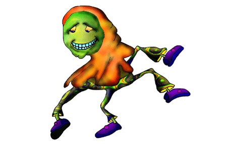 | opponent-portrait | Opponent 1 portrait | `frm_WinGame3`, `frm_Travel4`, `frm_Travel2_horizontal`, `frm_Travel3` via `"PNG/OP" + n + ".PNG"` (Gazillionaire.as:51134 et al.) | Green/orange grinning creature, purple shoes, dynamic running pose |
| OP1A.PNG | 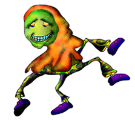 | opponent-portrait | Opponent 1 portrait (alt/unused) | *(none — orphaned, no `"A"` code path found)* | Same character as OP1, tighter crop, half-lidded/smug expression |
| OP2.PNG | 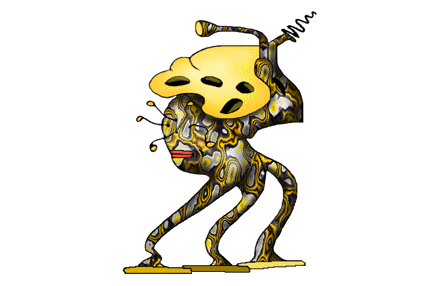 | opponent-portrait | Opponent 2 portrait | same call sites as OP1, `n=2` | Yellow/gold ornate mask-headed creature with dangling antennae |
| OP2A.PNG | 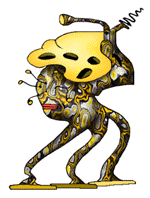 | opponent-portrait | Opponent 2 portrait (alt/unused) | *(none — orphaned)* | Same character as OP2, alt expression |
| OP3.PNG | 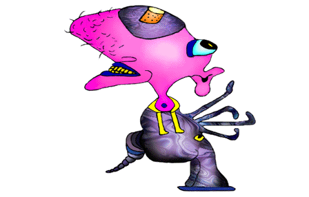 | opponent-portrait | Opponent 3 portrait | same call sites, `n=3` | Pink bristly-headed creature with clawed hand and blue eye patch |
| OP3A.PNG | 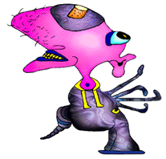 | opponent-portrait | Opponent 3 portrait (alt/unused) | *(none — orphaned)* | Same character as OP3, alt expression |
| OP4.PNG | 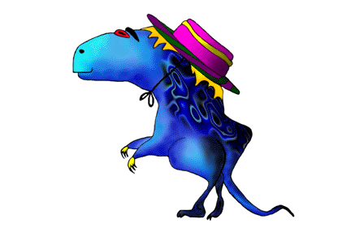 | opponent-portrait | Opponent 4 portrait | same call sites, `n=4` | Blue dinosaur-like creature wearing a striped top hat |
| OP4A.PNG | 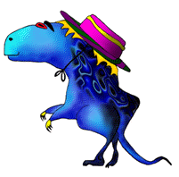 | opponent-portrait | Opponent 4 portrait (alt/unused) | *(none — orphaned)* | Same character as OP4, alt expression |
| OP5.PNG | 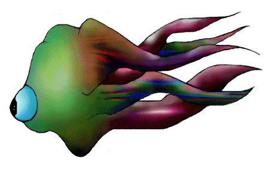 | opponent-portrait | Opponent 5 portrait | same call sites, `n=5` | Green tentacled creature with a single large blue eye |
| OP5A.PNG | 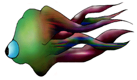 | opponent-portrait | Opponent 5 portrait (alt/unused) | *(none — orphaned)* | Same character as OP5, alt expression |
| OP6.PNG | 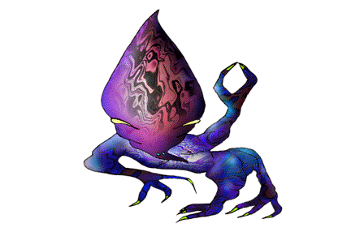 | opponent-portrait | Opponent 6 portrait | same call sites, `n=6` | Purple teardrop-headed creature with an insectoid clawed leg |
| OP6A.PNG | 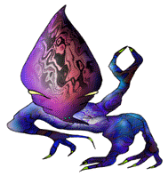 | opponent-portrait | Opponent 6 portrait (alt/unused) | *(none — orphaned)* | Same character as OP6, alt expression |
| n/a | — | planet-closeup (dead code) | Planet assets consolidated | — | See [Planets](Asset-Wiki-Planets) / [planets-catalog.md](planets-catalog.md) — all 14 `<PLANET>3.PNG` level-3 dead-code rows moved there, alongside each planet's other assets. |
| BLACK.PNG |  | gui | Blank/reset placeholder | Dozens of `Image.source` resets across nearly every screen, e.g. Gazillionaire.as:5033, 7269, 8667, 12513, 37981, 50100, 50325, 50718, 62908-62914, 63082/63093, 72061/72147/72183 | 142-byte solid black 1x1-ish placeholder |
| DIME.PNG | 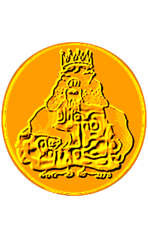 | gui | Gold coin / windfall seal | `frm_Travel2_vertical_image`, event 23 (Gazillionaire.as:63993) | Crowned figure embossed on a gold coin |
| TITLE.PNG |  | other | Gazillionaire logo wordmark (orphaned) | *(none found — live title screen uses `SWF/GAZ_TITLE_S.SWF` instead)* | Orange/yellow "Gazillionaire" TM wordmark |
| LAVAMIND.PNG | 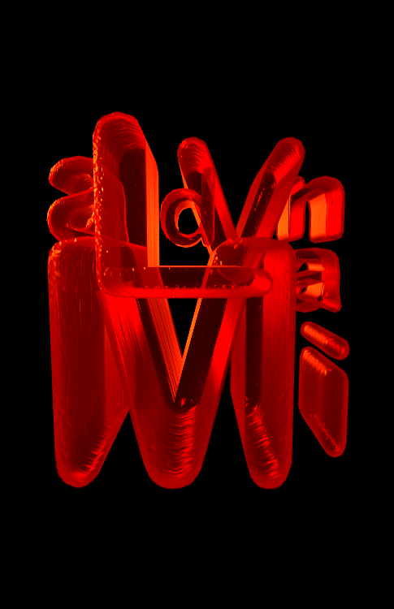 | other | Lavamind logo (orphaned) | *(none found — live splash uses `SWF/LAVAMIND_S.SWF` instead)* | Glowing red 3D "Lavamind" wordmark on black |

## Thumbnails

All 30 files copied to `docs/asset-wiki/thumbnails/loose-png/<lowercased-filename>.png`.
