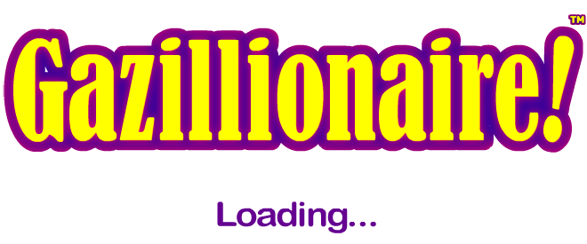
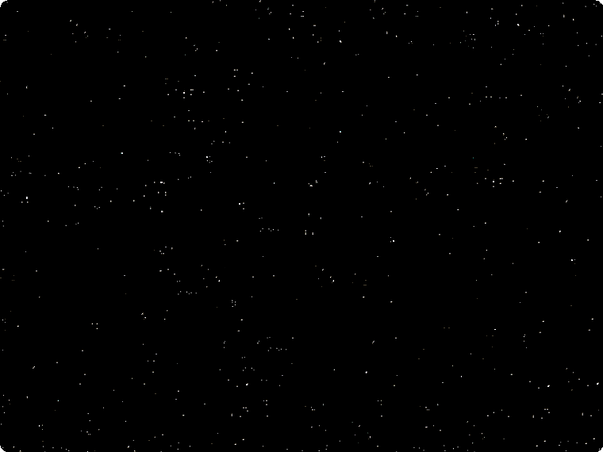

# Loose Pre-Build Resources Catalog (`Resources/resources/`)

Companion catalog to `docs/asset-inventory.md` (156 embedded classes),
`docs/asset-wiki/external-swf-catalog.md` (156 loose `.swf` files), and
`docs/asset-wiki/loose-png-catalog.md` (30 loose `Resources/PNG/` files). This
document covers the **60 files** at the lowercase-named
`Gazillionaire.app/Contents/Resources/resources/` folder, found during the
completeness sweep. Unlike the other two loose folders, these files are **not
loaded at runtime by the shipped game** — the `resources/` folder is leftover
pre-build source art: the same content the Flex/MXML compiler pulled in via
`[Embed(source="assets/...")]` when it built `Gazillionaire.swf`, still sitting
around from the original build tree.

## Relationship to main-SWF embeds

**51 of 60 files are confirmed duplicates of an already-cataloged main-SWF embed:**

- **31 `.swf` files** (7 `b_*`/`f_*` button/fuel-gauge skins, 5 icon-SWFs, 5 misc
  SWFs, 14 `PlanetNAME1.SWF` planet files) are **byte-for-byte identical**
  (`cmp` exit 0) to their companion `[Embed]`-backed `.bin` file already extracted
  under `engine/src/assets/`. Sample confirmations: `BASS1.SWF` / `FRAC1.SWF` /
  `HORK1.SWF` / `LORO1.SWF` / `MIRA1.SWF` / `NOSH1.SWF` / `OOOM1.SWF` / `PYKE1.SWF`
  / `QUEG1.SWF` / `STYE1.SWF` / `XEEN1.SWF` / `ZILE1.SWF` all `cmp`-identical to
  their respective `Gazillionaire_Planet<Name>1Class_dataClass.bin`; `TILO1.SWF`
  identical to `assets/148.bin` and `VEXX1.SWF` identical to `assets/139.bin`
  (the two files `docs/asset-inventory.md` finding #4 flagged as double-embedded
  under two class names — confirming there's really only one canonical file for
  each, now traced to its pre-build source name). `f_empty.swf`, `f_endblue.swf`,
  `f_endred.swf`, `f_full.swf`, `b_circle.swf`, and `i_arrow.swf` also confirmed
  byte-identical to their respective `_dataClass.bin`. This is decisive: SWFs
  aren't re-encoded on embed, so a byte match proves "this folder is just the
  same assets before compilation," not new content.

- **20 `.png` files** are the **same source art, re-encoded** (not byte-identical,
  but pixel-identical on visible/non-transparent pixels within compression
  rounding). Spot-checked with a numpy pixel diff: `i_bank.png`, `i_boy.png`, and
  `i_crew.png` (mapped to `engine/src/assets/144.png` via the class's
  `[Embed(source="assets/144.png")]`) each showed 0 alpha-channel difference and
  a mean visible-pixel RGB difference under ~1.1/255 (max isolated outlier 44–49,
  still far below a perceptible change) — consistent with the PNG having been
  losslessly re-embedded/re-exported through Flex's SWF bitmap pipeline and then
  re-extracted by `ffdec`, not genuinely different art. This covers: `i_bank`,
  `i_boy`, `i_boy_handup`, `i_explore`, `i_file`, `i_fuel`, `i_girl_handup`,
  `i_help`, `i_insure_yes`, `i_market`, `i_money`, `i_stock`, `i_supply`, `i_tax`,
  `i_zinn`, `i_loan`, `i_pickup`, `i_lamp_on`, `i_warehouse_closed`, and (found via
  their numeric-only embed target, see finding below) `i_crew`, `i_girl`,
  `i_insure_no`, `i_lamp_off`, `i_warehouse`.

**9 files are genuinely new/uncataloged relative to `docs/asset-inventory.md`:**

- **`f_fillblue.png` and `f_fillred.png` — CONFIRMED FIX for the known fuel-gauge
  gap.** `docs/asset-inventory.md` findings #5 (line ~82) and the two `[GAP]` rows
  (lines 207-208) state that `_class_embed_css_f_fillblue_png__944102544_696470983`
  and `_class_embed_css_f_fillred_png_97191697_987149254` carry **no `[Embed]` tag
  and no corresponding file anywhere** under `engine/src/assets/`, despite being
  actively wired up as `upSkin`/`overSkin`/`downSkin`/`disabledSkin` for the
  `fuelFillBlue`/`fuelFillRed` CSS classes (Gazillionaire.as ~76273-76315) — "the
  most important coverage gap for the modloader." These two loose files are a
  small horizontal gradient bar each (`f_fillblue.png`: light-blue-to-white
  gradient; `f_fillred.png`: red-to-white/orange gradient) — exactly the shape
  and coloring expected for a fuel-gauge "filling" bar segment, and exactly
  matching the two missing CSS class names by filename. **This looks like the
  real fix for the gap, pending maintainer confirmation** — there is nothing to
  `cmp`/diff against since no companion file exists in `engine/src/assets/` at
  all (per the inventory), so identity can't be proven byte-for-byte, only
  inferred from filename match + visual plausibility. **Not copied into
  `engine/src/` by this pass** — left as a maintainer decision — but copied for
  reference to `docs/asset-wiki/thumbnails/loose-resources/f_fillblue.png` and
  `f_fillred.png`.

- **`i_pay.png` and `i_study.png` — orphaned, no embed class or reference found at
  all.** Unlike the five names below, grepping `engine/src/` for `i_pay` or
  `i_study` (in any form: embed class name, `[Embed(source=...)]` path, or a
  literal use) returns nothing. `i_pay.png` is a green dollar-coin icon; `i_study`
  is a graduation-cap-over-keyboard icon. These look like cut UI icons for
  planned-but-unbuilt features (e.g. a "pay"/"study" action never added to the
  final UI) — genuinely present pre-build art with no shipped-game counterpart.

- **`busy_loading_bar.png`** — the "Gazillionaire! / Loading..." splash banner.
  No `PNG/`- or embed-based reference found in `Gazillionaire.as`; likely used by
  a native/Adobe AIR loading harness (e.g. a `preloader` or the app's
  `.airi`/install wrapper) outside the decompiled ActionScript, not by the SWF's
  own code.

- **`i_crew.png`, `i_girl.png`, `i_insure_no.png`, `i_lamp_off.png`,
  `i_warehouse.png`** — initially looked orphaned (no match by filename alone
  against a *named* `engine/src/assets/` file), but ARE embedded: each has a
  `Gazillionaire__embed_mxml_i_<name>_png_<hash>.as` class with an
  `[Embed(source="assets/<N>.png")]` tag pointing at a **numeric-only** asset file
  — exactly the "8 genuinely bare numeric-only entries" flagged as a naming gap in
  `docs/asset-inventory.md` finding #5. Confirmed matches: `i_crew.png` →
  `assets/144.png`, `i_girl.png` → `assets/91.png`, `i_insure_no.png` →
  `assets/109.png`, `i_lamp_off.png` → `assets/112.png`, `i_warehouse.png` →
  `assets/154.png`. Pixel-diffed `i_crew.png` against `assets/144.png`: 0 alpha
  difference, mean visible-pixel RGB difference 0.9/255 — same re-encoding pattern
  as the other PNGs, confirming these are the same art, not new content. **This
  also gives the asset-inventory's 8 bare-numeric files real names** — worth
  folding back into `docs/asset-inventory.md` as a follow-up.

## Full catalog

| Filename | Thumbnail | Category | Suggested name | Used at | Notes |
|---|---|---|---|---|---|
| b_circle.swf |  | gui | Circle button skin | `assets/95_..._dataClass.bin` (CSS button skin) | Identical duplicate |
| b_x2_dn.swf |  | gui | 2x speed button — down state | `assets/123_..._dataClass.bin` | Identical duplicate |
| b_x2_mo.swf |  | gui | 2x speed button — mouseover | `assets/121_..._dataClass.bin` | Identical duplicate |
| b_x2_up.swf |  | gui | 2x speed button — up state | `assets/127.bin` | Identical duplicate |
| b_x3_dn.swf |  | gui | 3x speed button — down state | `assets/96_..._dataClass.bin` | Identical duplicate |
| b_x3_mo.swf |  | gui | 3x speed button — mouseover | `assets/106_..._dataClass.bin` | Identical duplicate |
| b_x3_up.swf |  | gui | 3x speed button — up state | `assets/119_..._dataClass.bin` | Identical duplicate |
| n/a | — | environment | Planet assets consolidated | — | See [Planets](Asset-Wiki-Planets) / [planets-catalog.md](planets-catalog.md) — all 14 `<PLANET>1.SWF` resources-folder duplicate rows moved there, alongside each planet's other assets. |
| busy_loading_bar.png |  | other | Loading splash banner | *(not found in Gazillionaire.as — likely native/AIR loader)* | Genuinely new to the catalog; "Gazillionaire! Loading..." banner |
| f_empty.swf |  | gui-chrome | Fuel gauge — empty track | `assets/84_..._dataClass.bin` | Identical duplicate |
| f_endblue.swf |  | gui-chrome | Fuel gauge — blue end-cap | `assets/131_..._dataClass.bin` | Identical duplicate |
| f_endred.swf |  | gui-chrome | Fuel gauge — red end-cap | `assets/161_..._dataClass.bin` | Identical duplicate |
| f_fillblue.png |  | gui-chrome | **Fuel gauge — blue fill bar [GAP FIX candidate]** | `fuelFillBlue` CSS class, Gazillionaire.as ~76315 | **No embed exists to diff against** — filename + visual match strongly suggest this is the missing asset; light-blue-to-white gradient bar. Not copied into `engine/src/` — maintainer decision |
| f_fillred.png |  | gui-chrome | **Fuel gauge — red fill bar [GAP FIX candidate]** | `fuelFillRed` CSS class, Gazillionaire.as ~76285 | Same caveat as f_fillblue; red-to-white/orange gradient bar |
| f_full.swf |  | gui-chrome | Fuel gauge — full track | `assets/98_..._dataClass.bin` | Identical duplicate |
| Frame_help3.swf |  | gui | Help frame border | `assets/156_..._dataClass.bin` | Identical duplicate |
| i_arrow.swf |  | gui | Arrow icon | `assets/86_..._dataClass.bin` | Identical duplicate |
| i_bank.png |  | gui | Bank icon | `assets/169_..._i_bank_png_....png` | Same art, re-encoded |
| i_boy.png |  | gui | Boy icon | `assets/155_Gazillionaire_BoyIconClass.png` | Same art, re-encoded |
| i_boy_handup.png |  | gui | Boy (hand up) icon | `assets/130_Gazillionaire_BoyHandUpIconClass.png` | Same art, re-encoded |
| i_crew.png |  | gui | Crew/hire icon | `assets/144.png` via `[Embed(source="assets/144.png")]` | Same art, re-encoded; gives `assets/144.png` a real name |
| i_explore.png |  | gui | Explore icon | `assets/152_..._i_explore_png_....png` | Same art, re-encoded |
| i_file.png |  | gui | File icon | `assets/122_..._i_file_png_....png` | Same art, re-encoded |
| i_fuel.png |  | gui | Fuel icon | `assets/163_..._i_fuel_png_....png` | Same art, re-encoded |
| i_girl.png |  | gui | Girl icon | `assets/91.png` via `[Embed(source="assets/91.png")]` | Same art, re-encoded; gives `assets/91.png` a real name |
| i_girl_handup.png |  | gui | Girl (hand up) icon | `assets/145_Gazillionaire_GirlHandUpIconClass.png` | Same art, re-encoded |
| i_help.png |  | gui | Help icon | `assets/97_..._i_help_png_....png` | Same art, re-encoded |
| i_insure_no.png |  | gui | "No insurance" icon | `assets/109.png` via `[Embed(source="assets/109.png")]` | Same art, re-encoded; gives `assets/109.png` a real name |
| i_insure_yes.png |  | gui | "Yes insurance" icon | `assets/168_Gazillionaire_InsureYesIconClass.png` | Same art, re-encoded |
| i_lamp_off.png |  | gui | Lamp — off icon | `assets/112.png` via `[Embed(source="assets/112.png")]` | Same art, re-encoded; gives `assets/112.png` a real name |
| i_lamp_on.png |  | gui | Lamp — on icon | `assets/113_Gazillionaire_LampOnIconClass.png` | Same art, re-encoded |
| i_loan.png |  | gui | Loan icon | `assets/132_..._i_loan_png_....png` | Same art, re-encoded |
| i_market.png |  | gui | Market icon | `assets/83_..._i_market_png_....png` | Same art, re-encoded |
| i_money.png |  | gui | Money icon | `assets/158_..._i_money_png_....png` | Same art, re-encoded |
| i_pay.png |  | other | Pay icon (orphaned) | *(no embed class or reference found anywhere)* | Genuinely new to the catalog; green dollar-coin icon, no shipped-game usage found |
| i_pickup.png |  | gui | Pickup icon | `assets/101_Gazillionaire_PickUpIconClass.png` | Same art, re-encoded |
| i_planet.swf |  | gui | Planet icon | `assets/128_..._i_planet_swf_..._dataClass.bin` | Identical duplicate |
| i_stock.png |  | gui | Stock icon | `assets/149_..._i_stock_png_....png` | Same art, re-encoded |
| i_study.png |  | other | Study icon (orphaned) | *(no embed class or reference found anywhere)* | Genuinely new to the catalog; graduation-cap icon, no shipped-game usage found |
| i_supply.png |  | gui | Supply icon | `assets/162_..._i_supply_png_....png` | Same art, re-encoded |
| i_target.swf |  | gui | Target icon | `assets/93_..._i_target_swf_..._dataClass.bin` | Identical duplicate |
| i_tax.png |  | gui | Tax icon | `assets/134_..._i_tax_png_....png` | Same art, re-encoded |
| i_warehouse.png |  | gui | Warehouse (open) icon | `assets/154.png` via `[Embed(source="assets/154.png")]` | Same art, re-encoded; gives `assets/154.png` a real name |
| i_warehouse_closed.png |  | gui | Warehouse (closed) icon | `assets/99_Gazillionaire_WarehouseClosedIconClass.png` | Same art, re-encoded |
| i_zinn.png |  | gui | Zinn icon | `assets/94_..._i_zinn_png_....png` | Same art, re-encoded |
| stars_bg_main.swf |  | background | Starfield background | `assets/108_..._dataClass.bin` | Identical duplicate |
| stars_main.swf |  | background | Starfield (main) | `assets/167_..._dataClass.bin` | Identical duplicate |

## Thumbnails

All 60 files copied to `docs/asset-wiki/thumbnails/loose-resources/<lowercased-filename>`
(`.swf`/`.SWF` rendered to PNG frame 1 via `ffdec`, `.png` copied directly).
